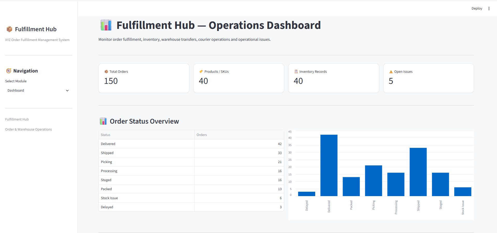
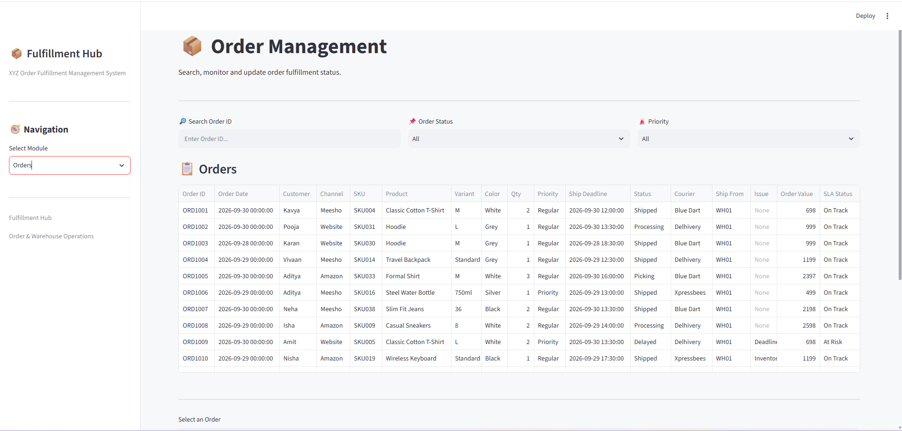
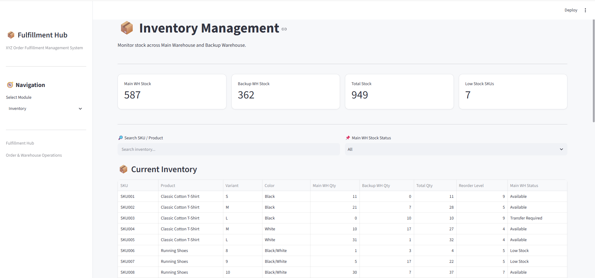
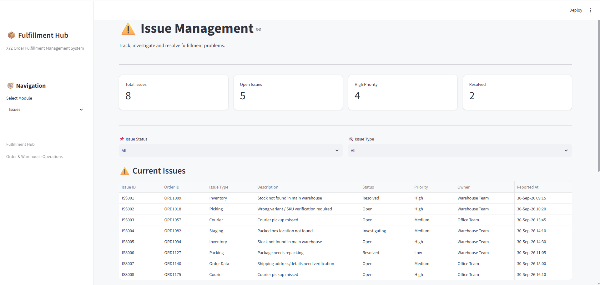
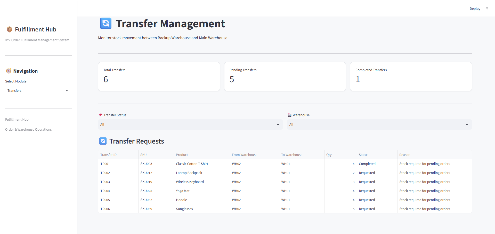
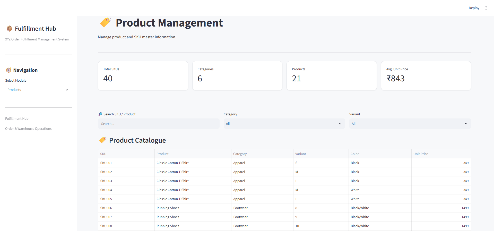
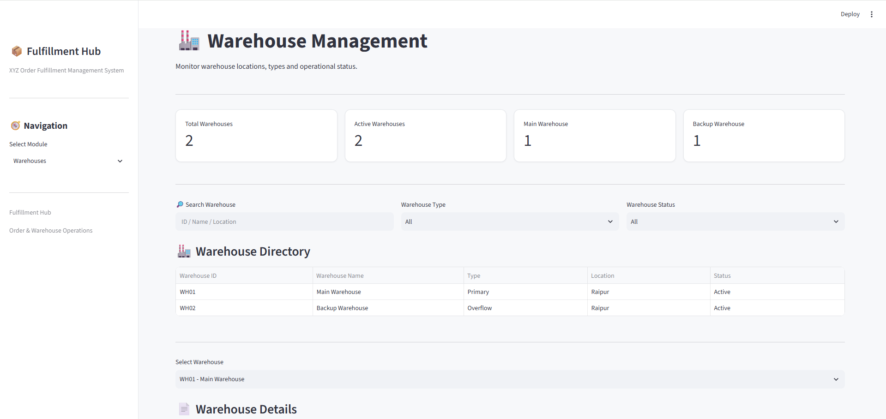
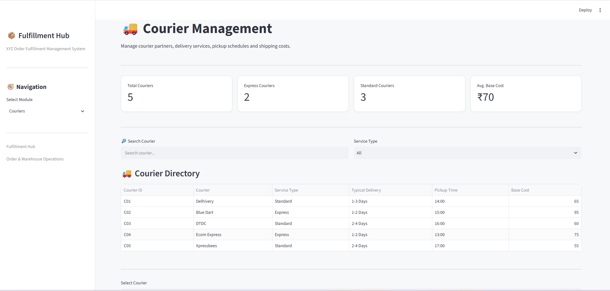

# 📦 Fulfillment Hub

### XYZ Order Fulfillment Management System

A Streamlit-based **e-commerce order fulfillment and warehouse operations management system** designed to help small businesses monitor orders, inventory, warehouse transfers, operational issues, products, warehouses, and courier operations from a single dashboard.

---

## 📌 Project Overview

Small e-commerce businesses may receive around **200–300 marketplace orders per day**, including priority and same-day orders.

Managing these orders manually can create operational challenges such as:

* Tracking order fulfillment status
* Monitoring stock across multiple warehouses
* Moving stock from a backup warehouse to the main warehouse
* Identifying low-stock products
* Managing operational issues
* Tracking courier pickup schedules and shipping costs
* Monitoring delayed or stock-related orders

**Fulfillment Hub** provides a centralized interface to monitor and manage these operational activities.

---

## 🎯 Business Problem

The fulfillment process involves multiple teams and operational steps:

**Order Received → Inventory Check → Picking → Packing → Staging → Courier Pickup → Shipping → Delivery**

The business also operates with:

* A **Main Warehouse**
* A **Backup/Overflow Warehouse**
* Multiple courier partners
* Office operations staff
* Warehouse staff

The system helps provide visibility into these processes through a single operational application.

---

## 💡 Solution

Fulfillment Hub provides separate modules for different operational areas:

* 📊 Dashboard
* 📦 Order Management
* 📦 Inventory Management
* ⚠️ Issue Management
* 🔄 Transfer Management
* 🏷️ Product Management
* 🏭 Warehouse Management
* 🚚 Courier Management

The application uses **SQLite** as the database and **Streamlit** for the user interface.

---

# ✨ Key Features

## 📊 Operations Dashboard

The dashboard provides a high-level overview of fulfillment operations.

### Dashboard metrics

* Total Orders
* Products / SKUs
* Inventory Records
* Open Issues

### Dashboard analysis

* Order Status Overview
* Recent Orders
* Order fulfillment monitoring

---

## 📦 Order Management

The Order Management module allows users to search, filter and monitor individual orders.

### Features

* Search by Order ID
* Filter by Order Status
* Filter by Priority
* View order details
* Monitor courier assigned to an order
* View warehouse source
* View order value
* Track fulfillment status

### Order information includes

* Order ID
* Order Date
* Customer
* Channel
* SKU
* Product
* Variant
* Color
* Quantity
* Priority
* Ship Deadline
* Status
* Courier
* Ship From
* Issue
* Order Value
* SLA Status

The system also highlights operational exceptions such as:

* Delayed orders
* Stock-related issues

---

# 📦 Inventory Management

The Inventory module provides visibility into stock across the two warehouses.

### Warehouses

* Main Warehouse
* Backup Warehouse

### Features

* Search by SKU or Product
* Monitor Main Warehouse stock
* Monitor Backup Warehouse stock
* Calculate total stock
* Compare stock against reorder levels
* Identify low-stock SKUs
* Generate stock transfer recommendations

### Inventory information

* SKU
* Product
* Variant
* Color
* Main Warehouse Quantity
* Backup Warehouse Quantity
* Total Quantity
* Reorder Level
* Main Warehouse Status

### Stock Transfer Logic

When stock in the Main Warehouse falls below the reorder level and stock is available in the Backup Warehouse, the system identifies the SKU as a potential transfer candidate.

The suggested transfer quantity is based on the difference between:

**Reorder Level − Main Warehouse Quantity**

---

# ⚠️ Issue Management

The Issue Management module helps track operational problems during fulfillment.

### Issue types include

* Inventory
* Picking
* Courier
* Staging
* Packing
* Order Data

### Features

* Filter issues by status
* Filter issues by issue type
* View issue details
* Monitor priority
* Identify issue owner
* Track reported time
* Resolve open or investigating issues

### Issue workflow

**Open / Investigating → Resolved**

---

# 🔄 Transfer Management

The Transfer Management module tracks stock movement between warehouses.

### Transfer flow

**Requested → In Transit → Completed**

### Features

* View transfer requests
* Filter by transfer status
* Filter by warehouse
* View SKU and product
* View transfer quantity
* View source warehouse
* View destination warehouse
* Update transfer status

This supports the operational requirement that stock can be moved from the **Backup Warehouse to the Main Warehouse** when required for order fulfillment.

---

# 🏷️ Product Management

The Product Management module maintains the product and SKU master information.

### Features

* Search SKU
* Search product
* Filter by category
* Filter by variant
* View product catalogue
* View product details

### Product information

* SKU
* Product
* Category
* Variant
* Color
* Unit Price

### Product metrics

* Total SKUs
* Categories
* Products
* Average Unit Price

---

# 🏭 Warehouse Management

The Warehouse Management module provides visibility into warehouse locations and operational status.

### Current warehouse structure

| Warehouse        | Type     | Location | Status |
| ---------------- | -------- | -------- | ------ |
| Main Warehouse   | Primary  | Raipur   | Active |
| Backup Warehouse | Overflow | Raipur   | Active |

### Features

* Search warehouse
* Filter by warehouse type
* Filter by status
* View warehouse details
* Monitor active warehouses

---

# 🚚 Courier Management

The Courier Management module provides information about available courier partners.

### Courier information

* Courier ID
* Courier Name
* Service Type
* Typical Delivery Time
* Pickup Time
* Base Cost

### Example courier services

* Delhivery
* Blue Dart
* DTDC
* Ecom Express
* Xpressbees

### Features

* Search courier
* Filter by service type
* View courier details
* Compare typical delivery timelines
* Monitor pickup schedules
* Review base shipping costs

---

# 🔄 Fulfillment Process

The application is designed around the following operational flow:

```text
Marketplace Order
       ↓
Order Processing
       ↓
Inventory Check
       ↓
Picking
       ↓
Packing
       ↓
Staging
       ↓
Courier Pickup
       ↓
Shipping
       ↓
Delivery
```

Operational exceptions can occur during the process:

```text
                  ┌──→ Delayed Order
Order Processing ─┤
                  └──→ Stock Issue
```

Inventory may also require movement between warehouses:

```text
Backup Warehouse
       ↓
Stock Transfer
       ↓
Main Warehouse
       ↓
Order Fulfillment
```

---

# 🗄️ Database Structure

The application uses **SQLite** for storing operational data.

### Main database

```text
fulfillment.db
```

### Tables

The database contains the following major tables:

### `orders`

Stores customer order and fulfillment information.

Key fields include:

* Order ID
* Order Date
* Customer
* Channel
* SKU
* Product
* Quantity
* Priority
* Ship Deadline
* Status
* Courier
* Ship From
* Issue
* Order Value
* SLA Status

### `inventory`

Stores warehouse-level inventory information.

Key fields include:

* SKU
* Product
* Variant
* Color
* Main WH Qty
* Backup WH Qty
* Total Qty
* Reorder Level
* Main WH Status

### `issues`

Stores operational issues and their resolution status.

### `transfers`

Stores stock transfer requests between warehouses.

### `products`

Stores product master information.

### `warehouses`

Stores warehouse master information.

### `couriers`

Stores courier partner information.

---

# 🛠️ Technology Stack

| Technology | Purpose                    |
| ---------- | -------------------------- |
| Python     | Application development    |
| Streamlit  | Web application interface  |
| SQLite     | Database                   |
| Pandas     | Data handling and analysis |

---

# 📁 Project Structure

```text
fulfillment-hub/
│
├── app.py
├── fulfillment.db
└── README.md
```

---

# ▶️ How to Run

## 1. Clone the repository

```bash
git clone <your-github-repository-url>
```

## 2. Open the project folder

```bash
cd fulfillment-hub
```

## 3. Install required libraries

```bash
pip install streamlit pandas
```

## 4. Run the application

```bash
python -m streamlit run app.py
```

The application will open in your browser at:

```text
http://localhost:8501
```

---

# 📊 Sample Operational Data

The project uses dummy operational data to demonstrate the fulfillment workflow.

The sample dataset includes:

* Orders
* Products
* Inventory
* Warehouse stock
* Transfer requests
* Operational issues
* Courier information

This allows the application to demonstrate realistic fulfillment scenarios without using production customer data.

---

# 📸 Project Screenshots

Screenshots can be added here after capturing the main application screens.

Recommended screenshots:

1. Dashboard
2. Order Management
3. Inventory Management
4. Issue Management
5. Transfer Management
6. Product Management
7. Warehouse Management
8. Courier Management

Example structure:

```text
screenshots/
├── dashboard.png
├── orders.png
├── inventory.png
├── issues.png
├── transfers.png
├── products.png
├── warehouses.png
└── couriers.png
```

---

# 🚀 Future Improvements

Possible future improvements include:

* Automated courier recommendation based on cost and delivery SLA
* Shipping label generation and courier API integration
* Barcode scanning for warehouse operations
* Automatic inventory reservation for orders
* Marketplace API integration
* User authentication and role-based access
* Email or notification alerts for operational issues
* Advanced fulfillment analytics
* Real-time inventory synchronization
* Automated low-stock alerts

---

# 📌 Project Objective

The objective of this project is to demonstrate how a small e-commerce business can use a centralized operational system to monitor:

**Orders + Inventory + Warehouses + Transfers + Issues + Couriers**

while improving visibility across the fulfillment process.

---

## 👨‍💻 Project

**Fulfillment Hub — XYZ Order Fulfillment Management System**

Built using:

**Python • Streamlit • SQLite • Pandas**

## 📸 Project Screenshots

### 📊 Dashboard


### 📦 Order Management


### 📦 Inventory Management


### ⚠️ Issue Management


### 🔄 Transfer Management


### 🏷️ Product Management


### 🏭 Warehouse Management


### 🚚 Courier Management
